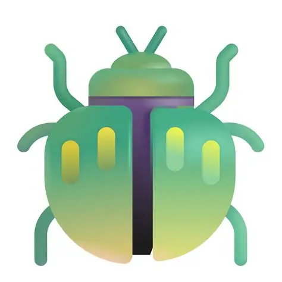

<div align="center">
  
  <h1>bash-claw: Ultra-Lightweight Personal AI Assistant</h1>
</div>

🪲 **bash-claw** is an **ultra-lightweight** personal AI assistant inspired by [OpenClaw](https://github.com/openclaw/openclaw) and [nanobot](https://github.com/HKUDS/nanobot).


**Stop chatting. Start doing.**

bash-claw bridges the gap between "thinking" and "doing." It connects your favorite LLMs to your local machine, allowing them to execute commands, manage files, and automate workflows directly on your computer.

##  Why bash-claw?

🪶 **Ultra-Lightweight**: A super lightweight implementation of OpenClaw and nanobot, significantly faster.

📍	**Zero Web Search Keys Required**: Forget about configuring complex search APIs. bash-claw works out of the box without needing external Web Search Keys, simplifying your setup instantly.

🚀	**Token Saver Mode**: We know inference costs add up. bash-claw is optimized to be lightweight, significantly reducing token consumption while maintaining high-performance execution.

🎨	**Minimal Dependencies**: No bloat. No complex environments. bash-claw relies on very few dependencies, ensuring a clean, fast, and stable installation on Windows, macOS, and Linux.

🔬 **Research-Ready**: Clean, readable code that's easy to understand, modify, and extend for research.

⚡️ **Lightning Fast**: Minimal footprint means faster startup, lower resource usage, and quicker iterations.

💎 **Easy-to-Use**: One-click to deploy and you're ready to go.

🛠️ What Can It Do?

**File Operations**: Read, write, rename, and organize files autonomously.

**Shell Execution**: Run terminal commands and scripts to automate system tasks.

**Browser Control**: Navigate the web, take screenshots, and interact with web elements.

**Code Generation & Execution**: Write and run code snippets to solve complex problems.


## 🚀 Quick Start

**1. Get API keys**

> Set your API key in `~/bash-claw/config.json`.
> Get API keys: [OpenRouter](https://openrouter.ai/keys) (Global)

**2. Configure** (`~/.nanobot/config.json`)

Add or merge these **two parts** into your config (other options have defaults).

*Set your API key* (OpenRouter):
```json
{
    "apiKey": "sk-or-v1-xxx"
}
```

*Set your model* (optionally pin a provider — defaults to auto-detection):
```json
{
    "model": "anthropic/claude-opus-4-5"
}
```

**3. Chat**

```bash
python bash-claw.py
```

That's it! You have a working AI assistant in 2 minutes.

## Supervision Mode

**Real-time Monitoring**: The supervisor observes agent's output, checking for:
- Relevance to the conversation context
- Consistency with previous statements
- Compliance with safety and policy guidelines
- Progress toward the user's goal

**Direct Correction**: When an agent produces incorrect or inappropriate content, the supervisor can provide specific feedback to the agent for learning

**Guidance and Prompts**: The supervisor can issue instructions to improve agent behavior

*Open Supervision Mode*:
```json
{
    "supervisor_mode": true
}

## Reference

This project draws extensive reference from [nanobot](https://github.com/HKUDS/nanobot) and [Web Content Fetcher](https://github.com/shirenchuang/web-content-fetcher).

## Requirements
OpenAI, scrapling, html2text


## ⚠️ Important Legal Notice & Disclaimer

**PLEASE READ CAREFULLY BEFORE INSTALLING.**

**bash-claw is for educational, research purposes only**

By downloading, installing, or using bash-claw ("The Software"), you explicitly agree to the following terms and conditions:

**1.	High Privilege Warning:** bash-claw operates with high system privileges to execute commands and modify files. This architecture inherently carries risks, including potential system instability or security vulnerabilities.

**2.	User Responsibility:** You acknowledge that the use of this Software is entirely at your own risk. The developers and contributors of bash-claw are not responsible for any direct or indirect damages, data loss, hardware failure, or security breaches caused by the use of this Software.

**3.	No Warranty:** This Software is provided "AS IS", without warranty of any kind, express or implied.

**4.	Indemnification:** You agree to indemnify and hold harmless the authors of bash-claw from any claims or liabilities arising out of your use of this Software.

If you do not agree to these terms, do not install or use this Software.
